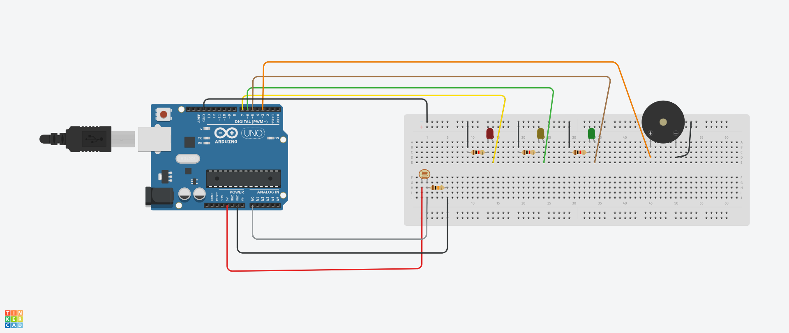
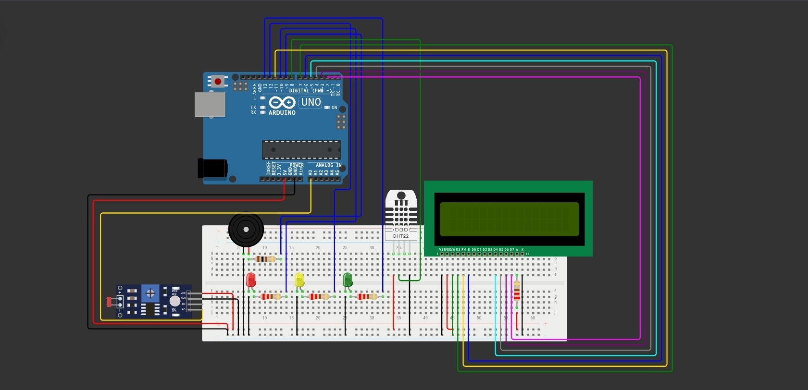

# 🍷 Vinheria Agnello — Sistema de Monitoramento Ambiental

> Projeto desenvolvido como parte da disciplina de Edge Computing & Computer Systems (FIAP).  
> Utiliza Arduino Uno com sensor LDR, sensor DHT11 e display LCD 16x2 para monitorar luminosidade, temperatura e umidade do ambiente de armazenamento de vinhos, acionando alertas visuais e sonoros em tempo real.

---

## Descrição do Projeto

O vinho é sensível a três fatores ambientais principais: **luminosidade**, **temperatura** e **umidade**. A exposição excessiva à luz degrada compostos orgânicos; variações de temperatura acima de 3°C causam aromas indesejados; e umidade fora da faixa ideal compromete vedantes e rótulos.

Este sistema monitora continuamente esses três fatores e responde de forma automática, exibindo os valores em um display LCD e acionando LEDs e buzzer conforme os níveis detectados.

> Os valores exibidos no display são a **média de 5 leituras consecutivas**, atualizados a cada **5 segundos**.

---

## Faixas Ideais de Armazenamento

| Fator | Faixa Ideal | Fonte |
|---|---|---|
| Temperatura | 10°C a 15°C | Alexander Pandell, PhD — UC |
| Umidade | 50% a 70% | Recomendação geral |
| Luminosidade | Ambiente escuro/penumbra | — |

---

## 🔴 Lógica de Alertas

### Luminosidade

| Estado | Condição | LED | Buzzer | Display |
|---|---|---|---|---|
| ✅ Adequado | Ambiente escuro | 🟢 Verde | Desligado | — |
| ⚠️ Alerta | Meia luz | 🟡 Amarelo | Desligado | `Ambiente a meia luz` |
| 🚨 Crítico | Muito claro | 🔴 Vermelho | Contínuo | `Ambiente muito CLARO` |

### Temperatura

| Estado | Condição | LED | Buzzer | Display |
|---|---|---|---|---|
| ✅ OK | Entre 10°C e 15°C | 🟢 Verde | Desligado | `Temperatura OK` + valor |
| ⚠️ Alta | Acima de 15°C | 🟡 Amarelo | Contínuo | `Temp. ALTA` + valor |
| ⚠️ Baixa | Abaixo de 10°C | 🟡 Amarelo | Contínuo | `Temp. BAIXA` + valor |

### Umidade

| Estado | Condição | LED | Buzzer | Display |
|---|---|---|---|---|
| ✅ OK | Entre 50% e 70% | 🟢 Verde | Desligado | `Umidade OK` + valor |
| ⚠️ Alta | Acima de 70% | 🔴 Vermelho | Contínuo | `Umidade ALTA` + valor |
| ⚠️ Baixa | Abaixo de 50% | 🔴 Vermelho | Contínuo | `Umidade BAIXA` + valor |

---

## Circuito Antigo (Luminosidade)



> Simulação montada no **Tinkercad**. O LDR lê a luminosidade e envia o sinal analógico à porta `A0` do Arduino, que processa e aciona os componentes conforme os limiares definidos no código.

🔗 [Acessar simulação no Tinkercad](https://www.tinkercad.com/things/iGE2alnjSsO-cp-vinheria-agnello)

[](https://youtu.be/E_VeabWIuwE?si=LpvlSQirIN8TYRqz)

---

## Circuito Atual (Ambiental)



> Simulação montada no **Wokwi** (sensor DHT22 como substituto do DHT11). O LDR lê a luminosidade via porta `A0`; o DHT11 lê temperatura e umidade via pino digital; o LCD 16x2 exibe os valores via comunicação I2C ou paralela.

🔗 [Acessar simulação no Wokwi](https://wokwi.com/projects/463841959926858753)

[](https://youtu.be/M6Er3k_67Ww?si=wdpfwa03QXsFueZl)

---

## 🧰 Componentes Utilizados

### Hardware

| Componente | Quantidade | Pino no Arduino |
|---|---|---|
| Arduino Uno | 1 | — |
| Sensor LDR (fotoresistor) | 1 | A0 |
| Resistor 10 kΩ | 1 | Divisor de tensão com LDR |
| Sensor DHT11 (ou DHT22) | 1 | D2 |
| Display LCD 16x2 (I2C) | 1 | SDA/SCL (A4/A5) |
| LED Verde (5 mm) | 1 | D5 |
| LED Amarelo (5 mm) | 1 | D6 |
| LED Vermelho (5 mm) | 1 | D7 |
| Resistores 220 Ω | 3 | Um por LED |
| Buzzer Passivo 5V | 1 | D3 |
| Jumpers | ~20 | — |
| Protoboard | 1 | 400 ou 830 pontos |

### Software

- **Arduino IDE** 2.x — [download](https://www.arduino.cc/en/software)
- **Biblioteca DHT sensor library** (Adafruit) — instalável via Library Manager
- **Biblioteca LiquidCrystal_I2C** (se usar LCD com I2C) — instalável via Library Manager

---

## Como Reproduzir

### Opção A — Simulação Online (Wokwi)

1. Acesse [wokwi.com](https://wokwi.com) e crie um novo projeto com **Arduino Uno**.
2. Adicione os componentes: LDR, DHT22, LCD 16x2, LEDs (verde, amarelo, vermelho) e Buzzer.
3. Monte conforme o esquema acima.
4. Cole o conteúdo do arquivo `vinheria_agnello.ino` no editor de código.
5. Clique em **Play** e varie os valores dos sensores para testar os diferentes estados.

> O Tinkercad não possui o sensor DHT11. Caso utilize Tinkercad, siga o modelo de simulação disponibilizado pelo professor.

### Opção B — Hardware Físico

1. Monte o circuito na protoboard conforme o esquema acima.
2. Instale as bibliotecas **DHT sensor library** e **LiquidCrystal_I2C** no Arduino IDE via `Sketch → Include Library → Manage Libraries`.
3. Abra o arquivo `vinheria_agnello.ino`.
4. Selecione a porta correta em **Ferramentas → Porta**.
5. Clique em **Upload** (Ctrl+U).
6. Abra o **Monitor Serial** (9600 baud) para acompanhar os valores lidos em tempo real.

---

## Ajuste dos Limiares

No arquivo `.ino`, as variáveis abaixo controlam os limites de cada estado. Ajuste conforme o ambiente real:

```cpp
// Luminosidade (valor analógico 0–1023)
int limiteOK     = 880;  // Abaixo → ambiente escuro (LED verde)
int limiteAlerta = 960;  // Entre os dois → meia luz (LED amarelo)
                         // Acima → muito claro (LED vermelho + buzzer)

// Temperatura (°C)
float tempMin = 10.0;
float tempMax = 15.0;

// Umidade (%)
float umidMin = 50.0;
float umidMax = 70.0;
```

Use o Monitor Serial para verificar os valores brutos dos sensores no seu ambiente e calibre conforme necessário.

---

## 🗂️ Estrutura do Repositório

```
checkpoint-1-Vinheria-Agnello/
├── vinheria_agnello.ino   ← Código-fonte do sistema luminosidade (antigo)
├── vinheria_agnello2.ino   ← Código-fonte do sistema ambiental (atual)
├── circuito.png           ← Imagem do circuito luminosidade
├── circuito.jpg           ← Imagem do circuito ambiental
└── README.md              ← Este arquivo
```

---

## Equipe

| Integrante | RM |
|---|---|
| Guilherme Tome Nogueira | 570144 |
| Lucas de Andrade Astorini | 569119 |
| Sabrina Lopes da Silva | 571870 |
| Sofia Satomi Hagio | 569120 |

---

## 📄 Licença

CheckPoint 2 — FIAP — Edge Computing & Computer Systems, 2026
